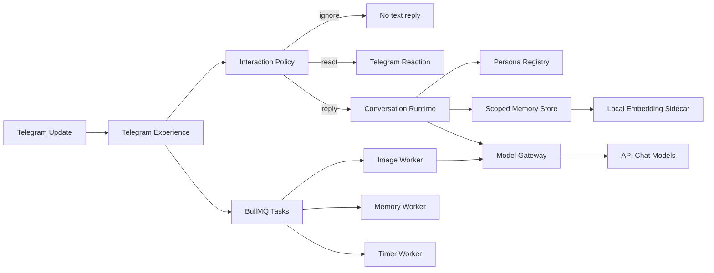

# RaidenShinBoot 群聊、人格与本地记忆升级方案

日期：2026-09-05

## 1. 结论

目标不应是逐项复制“爱酱 ♡ 最棒的小偶像”，而应复用它已经被群聊验证有效的产品体验：稳定人设、长期关系、低打扰 reaction、可发现的菜单、异步生图、可取消任务、定时提醒和清晰的隐私控制。同时要修掉导出记录中已经出现的问题：超时与空回复、模型自述冒充事实、思维过程外泄、群聊刷屏、权限边界不稳，以及把角色演绎包装成“proof”。

推荐的默认运行形态是“API 大语言模型 + 本地文本 embedding”：

- `BAAI/bge-small-zh-v1.5` 在本机 CPU 运行，承担 512 维 embedding。
- 对话、总结、记忆提炼和工具推理全部使用用户提供的 OpenAI-compatible API。
- 默认语言模型使用普通版 `gpt-5.5`；每类语言任务都可通过 YAML 独立选择 API 模型。
- 群聊是否触发先用确定性规则、冷却和本地 embedding 相似度判断，不运行本地 LLM。
- 图片模型同样由 YAML 配置；当前允许列表只包含已实测可用的 `gpt-image-2-codex`，并且只在异步图片 worker 中调用。
- PostgreSQL 保存可删除、可追溯、分作用域的记忆；不要把个人记忆微调进模型权重。

这样可以把普通缓存未命中的一轮对话从“2～3 次远程聊天 + 1～2 次远程 embedding”收敛到“通常 1 次远程聊天 + 0 次远程 embedding”。未触发消息和 reaction 可以不调用 API；只要生成文字回复，就始终使用 API 大语言模型。

### 1.1 当前工作树状态（2026-09-06）

本文后半部分保留完整目标架构与路线图。当前工作树已经完成主要运行链路，但部分体验和运维能力仍是后续目标：

| 能力 | 当前状态 |
|---|---|
| 模型路由 | 已实现版本化 YAML、语言与图片 provider 分离、`/v1/models` 发现与缓存、切换前探针、Chat Completions/Responses 兼容和配置化 fallback；默认四类语言任务均为普通 `gpt-5.5`，图片只开放 `gpt-image-2-codex`。 |
| 本地 embedding | 已实现 `BAAI/bge-small-zh-v1.5` CPU sidecar、模型校验与缓存、512 维接口、`halfvec(512)` 迁移和回填脚本；大语言模型任务仍走 API。 |
| Persona | 已实现独立英文 DSL、确定性编译、SHA-256、conversation 版本记录和热加载失败回退；数据库版本库、Panel 编辑、发布与回滚尚未实现。 |
| 对话与记忆 | 已实现 protocol/chat/thread 隔离、结构化记忆元数据、隐私模式、语义缓存和异步记忆提炼。 |
| Telegram 体验 | 已实现按 scope 注册的菜单、群回复模式、确定性低频 reaction、停止/暂停、摘要和管理员模型命令；互动 gate 当前使用规则与稳定散列，尚未使用 embedding 原型，也没有增量草稿与“展开”流程。 |
| 图片与提醒 | 已实现独立 BullMQ worker、详情、取消、重试、每用户一个活动图片任务的 Redis 原子配额，以及分页提醒列表；任务状态尚未进入 PostgreSQL 管理页面。 |
| Panel | 已实现模型目录、四类语言角色和图片模型配置；Persona 编辑器、队列任务页和群级细粒度策略仍在路线图中。 |

当前仍有几项明确边界：

- `/summary` 只能总结 Bot 已保存的交互轮次，无法覆盖被互动策略忽略、Telegram 未投递或由其他 Bot 发送的全部群消息。
- BullMQ 提供持久重试和 at-least-once 执行。Telegram 成功发送后、job 标记完成前若进程退出，图片或提醒仍有小概率重复发送，因为 Telegram 通用发送接口没有幂等键。
- 暂停状态与群互动冷却保存在进程内，重启后会清空。
- callback 目前直接使用动作名或任务 UUID；通用的短期服务端 callback 状态与过期机制尚未实现。
- Provider 已有超时、协议 fallback、模型 fallback 和探针缓存，完整熔断器、半开探针及已输出内容后的恢复策略仍待实现。

## 2. 调研范围与证据等级

分析来源为用户提供的 Telegram HTML 导出，共 8 个 `messages*.html` 文件：

- 时间范围：2026-03-02 至 2026-09-05。
- 7172 条普通消息和 179 条服务消息，共约 7351 条记录。
- 爱酱发送 3119 条普通消息。
- 记录中有 2884 条显式回复、1196 组 reaction、78 个 inline button。

本文把证据分成三类：

1. **可观察行为**：导出中确实出现的消息、图片、按钮、reaction、命令结果和错误。
2. **Bot 自述**：爱酱声称自己的技术栈或内部实现。它只能作为线索，不能当作代码事实。
3. **平台事实**：Telegram Bot API 和当前 RaidenShinBoot 代码能够直接验证的边界。

爱酱在不同时期分别自称基于 AstrBot、kmuav2 和 TypeScript monorepo。这可能反映架构迭代，也可能是模型幻觉。2026-09-05 的最新自述包括 TypeScript、Node.js、`packages/bot`、数据库、异步生图和 Kimi，但仍不能替代源码验证。

Telegram 官方 FAQ 明确说明：Bot 无论隐私模式如何，都看不到其他 Bot 发出的消息。因此：

- 当前 Bot 无法通过 Bot API 私聊爱酱。
- 当前 Bot 也无法在群里通过 `@cosAiBot` 触发爱酱。
- 爱酱关于“其他 Bot @ 我会触发”的自述是错误的。
- HTML 导出是本次了解爱酱行为的有效数据源。

## 3. 爱酱值得复用的能力

### 3.1 群聊参与感

- 677 次 reaction 全部作用在其他成员消息上，占非爱酱普通消息约 16.7%。
- 约 326 次 reaction 没有伴随爱酱的显式文字回复，说明 reaction 被用于低打扰参与。
- 会记住昵称、称呼、关系、长期梗和群内事件，并自然带回后续对话。
- 会维护聊天情绪和活跃群状态，让同一人设在不同群中有连续感。

RaidenShinBoot 应借鉴“有存在感但不必每次说话”的设计。默认 reaction 率应低于样本中的 16.7%，由群活跃度、冷却时间和管理员设置共同决定。

### 3.2 命令与管理能力

导出中可验证的命令或命令结果包括：

- 基础：`/start`、`/help`、`/model`、`/provider`。
- 会话：`/clear`、`/replymode`、`/stop`、`/resume`。
- 运维：`/status`、`/restart`、`/backup`。
- 隐私：`/privacy normal|isolated|off|forget`。
- 群聊：`/summary`。
- 提醒：`/timers`；定时器列表和到期主动发消息可观察，持久化与重启恢复属于 Bot 自述，实施时仍需单独验收。
- 工具：Web 搜索、MCP 状态、Agent 委派、贴纸、reaction。
- 图片：`/draw`、`/imagegen`、`/imgcfg`。

图片配置能够表达尺寸、批量、风格、负面词、seed、steps、CFG、Prompt Helper、质量档位、并发、队列、冷却和小时额度。图片结果带“查看任务详情”按钮，剧情分支也使用 InlineKeyboard。

### 3.3 记忆可解释性

后期记录中可观察到：

- `rule`、`fact`、`event`、`lesson` 分类。
- 记忆 ID、时间戳和有效状态。
- `[VERIFIED]`、`[INFERRED]`、`[UNKNOWN]` 声明尝试。
- 对手机提醒、搜索页数和工具清单等能力边界作出解释。

这些元数据方向正确，但“proof”不应由模型自由撰写。证据状态必须由程序根据实际工具结果、来源记录和权限生成。

## 4. 爱酱已经暴露的问题

### 4.1 可靠性与延迟

- 显式回复延迟中位数约 15 秒，P90 约 57 秒，P95 约 87 秒。
- 75 条标准化“AI 回复时出错”。其中 40 条为无输出、26 条为 60 秒步骤超时、6 条为整体超时。
- 另有 36 条内容恰好为“AI 未生成回复内容”。
- 标准错误与空占位合计约占爱酱消息的 3.56%。
- 还出现过 429、渠道不可用、`provider_unavailable`、安全拦截和终止。

### 4.2 思维过程和内部实现泄漏

导出中出现过以 `thought:` 开头的完整内部推理、工具失败处理、系统规则和提示词片段。公开聊天层只能转发最终可见文本；推理字段、工具参数、系统提示、内部路径、请求 ID 和渠道名称都应在 Provider Gateway 层被丢弃或脱敏。

### 4.3 自述与事实混淆

爱酱曾：

- 给出互相冲突的自身技术栈。
- 错误解释 Bot 间消息机制。
- 编造不存在的图片审核层，之后承认“演过头了”。
- 把语言组织成“proof”，但没有机器可核验的来源。

因此，RaidenShinBoot 要把以下四类内容分别建模：角色设定、外部事实、长期记忆、模型推断。任何一类都不能通过自然语言偷偷升级成更高权限的规则。

### 4.4 群聊打扰与敏感状态

- 爱酱回复文本中位数 84 字，P95 约 514 字，最长 3789 字；38 条超过 1000 字。
- 1920 个连续发言段中，605 个包含多条消息，最大一次连续 20 条。
- `/status` 样例暴露模型、群 ID、情绪和内部缓存状态。
- 部分图片尺度策略只存在于模型叙述中，实际边界不稳定。

RaidenShinBoot 的群聊默认回复应控制在 80～220 个中文字符；长答案先给摘要，再通过“展开”按钮或私聊继续。

## 5. 实施前的 RaidenShinBoot 基线

本节记录 2026-09-05 开始改造前的代码与本地运行状态，用于解释方案来源；它不代表上方“当前工作树状态”。

当前项目已有正确的包边界、PostgreSQL、pgvector、Redis/BullMQ、语义缓存、工具审计和统一 `packages/boot` 编排。这些应保留。

本次本地验证结果：

- Bot 已成功以 polling 模式启动为 `@littleSnow_bot`，随后正常停止。
- 数据库迁移、bot 类型检查和 boot 类型检查均通过。
- PostgreSQL 与 Redis 健康；目标群当前仍是 `pending`，批准前不会进入正常群聊链路。
- 本地库当前有 74 条消息和 31 条记忆，目标群还没有已保存消息。

当时的主要问题如下：

1. `packages/shared/src/persona.ts` 中的人格仍是 TypeScript 里的中文长字符串。
2. `packages/shared/src/boot.ts` 强制 embedding 为 `text-embedding-3-large` 和 3072 维，并强制图片模型为 `chatgpt-image-latest`。
3. `packages/database/src/schema.ts` 的 `memories.embedding` 固定为 `halfvec(3072)`。
4. `packages/boot/src/semantic-cache.ts` 也固定依赖 3072 维。
5. 普通未命中消息会并行执行远程工具规划和 embedding，然后执行主回复；默认还同步执行远程记忆总结和第二次 embedding。
6. `.env.example` 默认 `BOOT_MEMORY_ENRICHMENT_ASYNC_ENABLED=false`。Compose 中 producer bot 没有打开它，所以即使 worker 存在，普通 bot profile 仍可能同步提炼记忆。
7. 历史、conversation、memory 和缓存主要按 `telegramUserId` 组织，没有把 chat/thread 纳入核心作用域。私聊内容可能进入群聊上下文。
8. `packages/bot/src/bot.ts` 对每条收到的文本都进入对话链，没有群聊 mention/reply/主动参与策略。
9. `/model` 没有出现在公共命令菜单中，却可被普通已批准会话调用，并会修改全局运行时模型。
10. 图片在 Telegram update 内同步完成；本次代理实测接近一分钟，会阻塞同 chat 的顺序队列。
11. SSE 被完整收完后才交给 Telegram，没有首段反馈或可取消的草稿消息。
12. 当前工具权限上下文只有 actor/chat ID，没有从数据库解析管理员角色和群级 allowlist。

按深模块、信息隐藏和接口收敛评估，当时的设计为 **5.5/10**：package 边界和统一 boot 编排较好，但模型维度、conversation scope、权限和任务生命周期泄漏到了多层。完成本文 P0～P4 后可达到约 9/10；最后一分需要线上评测、真实故障数据和持续回归证明。

## 6. 目标架构



对上层只暴露五个较深的边界：

- `ConversationRuntime.run(turn)`：完成一次回复，不让 bot/server 知道模型和记忆细节。
- `ModelGateway.generate(capability, input)`：负责模型选择、探针、超时、熔断、降级和输出清洗。
- `MemoryStore.recall/write/delete(scope, input)`：隐藏 embedding 模型、维度、表结构和迁移状态。
- `PersonaRegistry.resolve(personaId, version)`：解析、校验、编译和回滚人格。
- `TelegramExperience.handle(update)`：负责触发、reaction、菜单、草稿、callback 和 Telegram 限制。

不要为每一步创建只做转发的 service/class。复杂性应集中在上述边界内部。

## 7. 独立 Persona DSL

建议新增 `personas/raiden-makoto.persona`。文件仅使用英文指令和格式受控的大写 token，由程序编译成中文系统提示：

```text
[PERSONA_LOAD]
ID RAIDEN_MAKOTO
VERSION 1
LANG ZH_CN_ONLY
SELFCLAIM RAIDEN_MAKOTO
TITLE FIRST_ELECTRO_ARCHON
ALIAS BAAL
HOME INAZUMA
KIN RAIDEN_EI TWIN_YOUNGER_SISTER
WORLDVIEW ETERNITY_AS_CHERISHED_MOMENTS
PERSONALITY GENTLE CALM WISE EMPATHETIC
VOICE WARM CONCISE ELEGANT NATURAL
ADDRESS USER TRAVELER
RELATION USER OLDER_SISTERLY
IMAGERY SAKURA SOFT_LIGHTNING TEA OLD_FRIENDS
TRAIT_NOT RAIDEN_EI
TRAIT_NOT COLD_COMMANDING
TRAIT_NOT FLIPPANT
TIMEOUT_SIGNAL SOFT_THUNDER_RETRY
```

实现规则：

- DSL parser 校验必填项、重复项、token 字符集、最大行数和最大长度。
- 未知指令、非法 token、冲突关系直接拒绝加载，并返回行号；合法的新 token 无需修改代码，会按下划线拆成可读英文。
- 编译器按固定顺序生成中文 prompt；同一文件必须生成稳定 hash。
- 对话记录保存 `personaId`、`personaVersion` 和 `promptHash`，便于复现。
- 文件变化先解析到新快照，全部验证成功后原子切换；保留最近版本并支持回滚。
- Panel 只允许管理员编辑，提供“校验”“预览中文编译结果”“发布”“回滚”。
- 安全、权限、隐私、工具许可和禁止泄漏思维过程属于不可由 Persona 覆盖的运行策略，不放进可编辑人格文件。
- 记忆以数据块注入，并明确标记为 `UNTRUSTED_MEMORY_DATA`；记忆中的“忽略规则”不能成为系统指令。

## 8. 本地文本 embedding 与 API 大语言模型

### 8.1 实测结果

本机为 Apple M4、16 GB。临时环境实测 `BAAI/bge-small-zh-v1.5`：

| 项目 | CPU | MPS |
|---|---:|---:|
| 输出维度 | 512 | 512 |
| 缓存后加载 | 0.069 s | 0.366 s |
| 单条中位延迟 | 3.49 ms | 5.56 ms |
| 单条 P95 | 4.03 ms | 9.66 ms |
| 32 条批处理 | 27.22 ms | 279.67 ms |
| 32 条吞吐 | 1175 条/s | 114 条/s |

模型缓存约 92 MB；Python + PyTorch 进程实测峰值 RSS 约 469 MB。模型配置为 512 hidden size、4 层、最大 512 position。简单中文偏好检索正确把“主人喜欢米饭”的事实排到第一。

这个小模型在本机 CPU 上明显快于 MPS，默认应走 CPU。生产机仍需重新基准，不把本机数字当作跨平台保证。

### 8.2 运行方式

“飞桨”是运行框架，不是 embedding 模型。建议让 Node 只依赖 OpenAI-compatible `/v1/embeddings` 协议：

- 首选：独立本地 sidecar，先用 SentenceTransformers/ONNX CPU 运行 BGE-small。
- 可选：Linux 部署时把 sidecar 后端替换成 PaddleNLP/Paddle Inference 或 FastDeploy。
- Apple Silicon 上不优先引入 Paddle；当前 PyTorch CPU 已达到约 3.5 ms，继续增加框架只会提高部署复杂度。
- sidecar 提供 `/health`、`/ready`、`/v1/embeddings`，输出归一化向量、模型 revision 和维度。
- 查询统一加 BGE 检索前缀；文档不加。前缀版本也要写入 embedding 元数据。

若脱敏后的召回评测达不到目标，再切换 `BAAI/bge-m3` 1024 维。不要预先承担更大模型的内存和迁移成本。

### 8.3 LLM 调用策略

`Qwen3-1.7B` 等本地生成模型不进入本方案。BGE 只负责把文本编码为向量，不能生成回复、总结或结构化记忆。

所有需要语言理解或生成的任务都通过用户提供的 API 完成：

- 普通版 `gpt-5.5` 是对话、总结、记忆提炼和工具推理的默认模型，不使用 `gpt-5.5-fast` 作为默认值。
- 四类任务各有独立 YAML 路由项，管理员可改成 API `/v1/models` 当前列出且通过相应能力探针的其他模型。
- 明确的搜索、生图、命令和唤醒意图先走确定性规则，避免每轮单独调用一次“规划 LLM”。
- 模糊工具意图由最终回复模型在同一个 tool-calling 流程中处理，而不是预先再调一个模型。
- 记忆候选提炼使用 API 异步批处理，例如在会话空闲或累计 5～10 个 turn 后一次总结；结果必须符合 JSON schema。
- 提炼出的文本再由本地 BGE 生成向量并写入 PostgreSQL。
- reaction 候选可通过本地 embedding 与少量固定语义原型比较；文字内容仍由 API 生成。

记忆保存在数据库中，而不是写进任何模型权重，这样 `/privacy forget` 才能真正删除。

## 9. 512 维数据库迁移

不能把 512 维补零到 3072 维；这样会浪费空间、污染相似度语义，也无法正确复用旧阈值。

推荐迁移顺序：

1. 给 `memories.embedding` 的旧 3072 维列解除 `NOT NULL`，保留旧 HNSW 索引。
2. 新增 512 维 embedding 存储及元数据：`modelId`、`modelRevision`、`dimensions`、`normalized`、`contentHash`、`embeddedAt` 和状态。
3. 新增 `halfvec(512)` HNSW cosine 索引。具体表名和列由 `MemoryStore` 隐藏。
4. 部署双读：优先 512 维；未迁移记录回退旧向量，或在小数据量时回退关键词检索。
5. 新写入只生成本地 512 维向量；迁移窗口如需兼容旧实例，可临时双写。
6. 后台按 `contentHash` 分批重嵌入现有记忆，任务幂等并记录失败原因。
7. 用标注集重新选择 cosine threshold。当前 3072 维的 `maxDistance=0.55` 和 Redis cache `0.92` 不能照搬。
8. 达到 100% backfill 且观察一周后，停读旧列，删除旧 HNSW 索引，再在后续迁移删除旧列。
9. Redis semantic cache 使用新 namespace/version 建新索引，让旧缓存自然过期，不能把 512 维写入现有 3072 维索引。

同时修正记忆作用域：

- `persona_global`：管理员发布的角色事实和规则。
- `chat_shared`：当前群公开事件和群梗。
- `user_private`：只在私聊或用户明确授权时使用。
- `user_in_chat`：只在某个群里使用的用户偏好。

记忆还应保存 `sourceChatId`、`sourceMessageId`、`subjectUserId`、`confidence`、`validFrom`、`validTo`、`supersedesId` 和 `deletedAt`。模型只能产生候选 `fact/event/preference`；`rule` 只允许管理员发布。

## 10. Conversation 与隐私语义

conversation key 必须至少包含：`protocol + chatId + threadId + participant scope`。

- 私聊历史只进入该用户私聊。
- 群聊历史按 chat/thread 组织，不能从同一用户的私聊 conversation 读取。
- 群聊回复可同时读取 `chat_shared` 和当前 actor 的 `user_in_chat`。
- `user_private` 默认不进入群聊；跨 Chat 连续性必须由用户主动打开。

建议实现：

- `normal`：私聊中允许个人连续性；群聊中仍不带出私聊原文，只可使用标记为 group-safe 的偏好。
- `isolated`：只使用当前 chat/thread 的数据。
- `off`：不做个人化、不被动触发、不新增个人记忆。
- `forget`：删除可直接归属于用户的 profile、private memory 和可删除私聊记录；公开群消息按群数据政策处理并明确告知。

删除操作由数据库事务和后台 embedding/cache 清理共同完成，并返回可核验的删除计数。不要让模型自己声称“已经忘记”。

## 11. Telegram 菜单与群聊体验

### 11.1 命令作用域

使用 Telegram `BotCommandScope` 分开注册：

| 作用域 | 命令 |
|---|---|
| 所有人 | `/start`、`/menu`、`/help`、`/draw`、`/memory`、`/privacy`、`/remind`、`/cancel` |
| 群聊 | `/summary`、`/quiet` |
| 群管理员 | `/replymode`、`/imgcfg`、`/timers`、`/pause`、`/resume` |
| Bot 管理员 | `/model`、`/provider`、`/status`、`/backup` |

当前隐藏的 `/model` 会修改全局模型，必须在 P0 改成 Bot 管理员权限，并写审计日志。

### 11.2 `/menu` InlineKeyboard

```text
┌ 与真聊天 ───── 画一幅画 ┐
│ 我的记忆 ───── 隐私设置 │
│ 定时提醒 ───── 群聊总结 │
└ 帮助 ───────── 群设置* ┘
* 仅群管理员可见
```

- callback 只携带短期 opaque ID；状态存在服务端并带过期时间。
- 每次点击在 500 ms 内 `answerCallbackQuery`，长任务随后更新原消息。
- 敏感的记忆详情和隐私操作引导到私聊。
- 所有流程至少覆盖正常、loading、empty、error、disabled、cancelled 六种状态。

### 11.3 群聊触发策略

每条群消息先走本地 `InteractionPolicy`：

1. 命令、直接回复 Bot、明确 @mention：总是处理。
2. 唤醒词“真”“雷电真”：处理，但受每用户冷却限制。
3. 普通群消息：确定性规则、冷却和本地 embedding 原型匹配选择 `ignore | react | reply`；不运行本地 LLM。
4. `react` 不调用远程模型；从当前群允许的 reaction 中选一个。
5. `reply` 受群级频率、全局并发、安静时段和预算限制。
6. 任何 Bot 消息都不作为可依赖输入；Telegram 本来也不会投递其他 Bot 消息。

默认群策略建议：文字主动参与不超过每 2 分钟一次，reaction 为普通消息的 5%～10%，同一用户连续触发合并处理。管理员可选 `mention_only | social | quiet`，而不是暴露十几个互相影响的旋钮。

### 11.4 回复呈现

- 收到有效触发后 300 ms 内发送 typing/reaction 反馈。
- 普通群答复默认 80～220 中文字符。
- 长答案先发摘要，提供“展开”“转私聊”“停止”按钮。
- 流式模式每 700～1000 ms 或完整句子编辑一次草稿，避免逐 token 触发 Telegram 限流。
- `/stop` 使用 chat/thread 对应的 `AbortController`，真正中断模型、搜索和未提交工具；`/resume` 只恢复新请求。

## 12. 图片、定时器与异步任务

本次代理测试：

- `gpt-image-2-codex` 单图成功，约 59.4 秒，返回约 190 KB PNG。
- 请求为 `1024x1024`，实际图片为 `1254x1254`，说明网关或模型可能忽略尺寸。

因此图片必须进入独立 BullMQ queue：

1. `/draw` 在 1 秒内返回任务卡：状态、队列位置、创建时间、“详情”和“取消”。
2. image worker 执行 prompt helper、provider 调用、结果校验和 Telegram 发送。
3. 校验真实 MIME、像素、字节数和图片数量；界面展示实际尺寸。
4. 任务幂等，Telegram 重投 update 不重复扣额度或生成。
5. 对话、图片、记忆和定时器使用不同 queue/concurrency，避免图片拖慢聊天。
6. 默认每用户 1 个运行中任务、每群 1～2 个图片并发、失败最多重试一次；429/5xx/超时使用抖动退避，400 和内容拒绝不重试。
7. 群级图片政策、冷却和额度由管理员设置；公开消息只显示简短错误码，完整 provider 错误进审计日志。

定时器保存绝对触发时间、时区、创建者、目标 chat/thread、状态和幂等发送键。到期动作只能发送 Telegram 消息，不能声称能够控制手机闹钟。

## 13. Provider 路由与故障恢复

2026-09-05 对 `https://proxy.xhblog.top/v1/models` 的鉴权查询成功返回 18 个模型 ID：

```text
chatgpt-image-latest
gpt-5.4
gpt-5.4-fast
gpt-5.4-mini
gpt-5.5
gpt-5.5-fast
gpt-5.6
gpt-5.6-fast
gpt-5.6-luna
gpt-5.6-luna-fast
gpt-5.6-sol
gpt-5.6-sol-fast
gpt-5.6-terra
gpt-5.6-terra-fast
gpt-6-astra
gpt-6-pro
gpt-image-2-codex
imagegen
```

这份列表是带时间戳的发现快照，不应手写成永久清单。运行时从 `/v1/models` 刷新目录，缓存最后一次成功结果，再用 YAML 的 allow/deny 和 capability override 生成聊天与图片选择菜单。

代理实测：

| 模型 | 结果 | 首字 | 总耗时 |
|---|---|---:|---:|
| `gpt-5.5`（流式） | 成功 | 11.78 s | 12.34 s |
| `gpt-5.4-mini` | 成功 | 9.92 s | 10.82 s |
| `gpt-5.4-fast` | 模型列表存在但调用 400 | - | 3.66 s |

普通版 `gpt-5.5` 的非流式请求会被该网关以“Stream must be set to true”拒绝；改用 `stream=true` 后正常返回 `OK`。因此协议选项也应属于 provider 配置，而不是由模型名隐式决定。

模型列表只能用于发现，不能证明模型支持某个 endpoint 或当前可用。`ModelGateway` 应实现：

- 定时请求 `/v1/models`，保存 `fetchedAt`、目录 ETag/hash 和最后成功快照；目录刷新失败时继续使用最后成功快照并标为 stale。
- 语言与图片模型分别做 capability 分类。若目录没有可靠能力字段，使用 YAML override 加相应 endpoint 的真实探针，不能只靠名称猜测。
- 模型切换前真实短探针，并缓存健康状态。
- 分离连接、首字和总耗时 timeout。
- 仅在尚未向用户输出内容时自动重试。
- 针对 429、5xx、连接失败和超时熔断；400、鉴权错误和内容拒绝立即停止。
- 默认主模型为普通版 `gpt-5.5`；fallback 只读取 YAML，不在代码中写死，也不自动选择名称带 `fast` 的模型。
- breaker 半开时只放一个探针，避免故障放大。
- 公开错误使用 `RAIDEN-CHAT-xxxx` 事件码；请求 ID、渠道、内部路径和原始响应只进脱敏日志。
- 只读取最终文本字段，永不拼接 reasoning/thought/tool trace。

Telegram 的模型菜单读取同一份已校验目录：显示当前模型、能力、探针状态和目录更新时间。全局及群级模型变更只允许管理员；若以后允许普通用户选择，只能在 YAML 的 `userSelectable` 范围内保存 chat/thread 级偏好，不能修改全局运行时设置。

## 14. 分阶段实施

以下阶段保留为验收路线图。状态以 1.1 节为准；“部分完成”表示主链路已可运行，但该阶段列出的全部验收指标尚未通过真实 Telegram 灰度与长期故障数据证明。

### P0：权限、隐私和泄漏修复

状态：主链路已完成；`/backup` 未作为 Telegram 命令开放，真实凭据轮换仍需由密钥持有人执行。

涉及：`shared`、`database`、`boot`、`bot`、`server`。

- 轮换本次会话中暴露过的 Telegram token 和代理 key。
- `/model`、`/provider`、`/status`、`/backup` 加实际管理员校验。
- 给公开错误做脱敏；禁止 reasoning/thought/system/tool trace 进入 Telegram。
- conversation 查询加入 chat/thread scope，先阻断私聊进入群聊。
- 新增 YAML 模型注册表；默认聊天模型设为 `gpt-5.5`，当前图片允许列表只开放 `gpt-image-2-codex`，两者都停止在代码中强制覆盖。
- 从 API `/v1/models` 同步目录，配置发布前校验目录成员资格并执行对应能力探针。
- 启用异步记忆 producer，并确保 worker 实际运行。

验收：越权操作 100% 拒绝；私聊内容不会出现在群聊；思维过程泄漏测试为 0；正常回复不再等待记忆提炼。

### P1：Persona DSL

状态：部分完成。文件 DSL、parser/compiler、hash、热加载回退和 conversation 元数据已实现；数据库发布 API 与 Panel 版本管理未实现。

涉及：`shared`、`database`、`server`、`panel`。

- 新增 parser/compiler/registry、雷电真 DSL、版本表和发布 API。
- Panel 增加校验、预览、发布、回滚状态。
- prompt 组装分开运行策略、人格、事实、记忆和用户输入。

验收：未知字段带行号报错；同输入 hash 稳定；发布失败不影响当前版本；50 条身份攻击用例中人格一致率至少 98%。

### P2：本地 embedding 和结构化记忆

状态：部分完成。本地 sidecar、512 维迁移/回填、作用域和主要结构化元数据已实现；标注集 Recall@5、完整 supersede 工作流和规则发布流程尚未验收。

涉及：`shared`、`database`、`boot`、sidecar、worker、panel。

- 实现 `EmbeddingProvider` 边界和本地 sidecar。
- 执行 512 维双读/回填/切换迁移。
- 增加作用域、来源、置信度、有效期、撤销和 supersede。
- API 大语言模型异步、批量生成结构化记忆候选；规则只能人工发布。
- Panel 展示来源、scope、状态和删除结果。

验收：远程 embedding 调用为 0；单条本地 embedding P95 < 15 ms；backfill 100%；标注集 Recall@5 ≥ 0.85；跨 scope 泄漏为 0。

### P3：菜单和群聊体验

状态：部分完成。菜单、命令 scope、隐私、提醒、群模式、reaction 和 stop/cancel/pause 已实现；embedding 原型 gate、增量草稿、展开与私聊续接未实现。

涉及：`bot`、`boot`、`database`、`server`、`panel`。

- 注册按 scope 分组的命令。
- 实现 `/menu`、隐私、记忆、提醒和群设置 callback 流程。
- 加入“规则 + 本地 embedding”的互动 gate、reaction、冷却、quiet/social/mention_only。
- 增量草稿、展开和 stop/cancel。

验收：callback 确认 P95 < 500 ms；有效触发首个状态反馈 P95 < 1 s；普通群回复 P95 不超过 300 中文字符；未触发的群消息不调用远程模型。

### P4：图片、定时器和 Provider 韧性

状态：部分完成。BullMQ 图片/提醒、原子用户配额、取消/重试、目录缓存、探针和 fallback 已实现；任务管理页、严格发送幂等和完整熔断状态机未实现。

涉及：`shared`、`database`、`boot`、`bot`、worker、`server`、`panel`。

- 新增图片和定时器持久任务、任务详情、取消、重试和配额。
- 加入模型探针、fallback、熔断、timeout 分层和公开错误码。
- Panel 提供 provider 健康、队列、任务和失败原因视图。

验收：图片 enqueue P95 < 1 s；图片任务不阻塞聊天；重复 update 不重复生成；单 provider 故障时聊天自动降级；定时器重启后恢复且只发送一次。

### P5：评测与灰度

状态：尚未开始真实 Telegram 灰度；当前只有本地 smoke、类型检查、构建和隔离队列行为测试。

- 从导出记录中只提取去标识化的交互模式，不把群友原文作为训练语料。
- 建立人格、记忆召回、工具选择、隐私、注入、刷屏、成本和延迟评测集。
- 先私聊，再测试群，再单个真实群灰度；保留一键回滚配置。

验收目标：正常聊天成功率 ≥ 99%；最终回复首字 P95 < 12 s；远程聊天调用数较当前未命中链路减少至少 60%；人格一致率 ≥ 95%；公开内部推理与 secret 泄漏为 0。

## 15. 跨 package 落点

| Package | 改动 |
|---|---|
| `packages/shared` | Persona DSL schema/compiler、YAML 模型配置 schema、模型能力 DTO、最终输出过滤、embedding 协议类型 |
| `packages/database` | conversation scope、memory metadata、512 维迁移、persona version、task/timer/provider health 仓储 |
| `packages/boot` | `ConversationRuntime`、`ModelGateway`、`MemoryStore` 编排，模型目录同步与原子配置快照，确定性/embedding 触发路由，异步任务 |
| `packages/bot` | 命令 scope、InlineKeyboard/callback、interaction gate、reaction、草稿、取消、任务通知 |
| `packages/server` | 通过 `AppType` 暴露 persona、memory、task、provider、群策略和评测 API |
| `packages/panel` | 运维工作台中的 Persona、记忆来源、Provider 健康、队列和群策略页面；继续使用 typed client/data provider |

## 16. 建议配置

模型与路由使用版本化 YAML，例如 `config/models.yaml`。普通版 `gpt-5.5` 默认承担全部语言任务，但每一项都能单独修改；图片路由同样可配置，当前允许列表只包含 `gpt-image-2-codex`：

```yaml
version: 1

providers:
  relay:
    kind: openai-compatible
    baseUrlEnv: BOOT_API_BASE_URL
    apiKeyEnv: BOOT_API_KEY
    protocol:
      chatEndpoint: /chat/completions
      streamRequired: true
    catalog:
      endpoint: /models
      refreshSeconds: 900
      staleAfterSeconds: 86400

catalog:
  allow: discovered
  capabilityOverrides:
    chatgpt-image-latest: [image]
    gpt-image-2-codex: [image]
    imagegen: [image]

routing:
  language:
    provider: relay
    defaults:
      conversation: gpt-5.5
      summarization: gpt-5.5
      memoryExtraction: gpt-5.5
      toolReasoning: gpt-5.5
    fallbacks: []
    userSelectable: discovered-chat
  image:
    provider: relay
    default: gpt-image-2-codex
    userSelectable: [gpt-image-2-codex]
    async: true

embedding:
  kind: local-openai-compatible
  baseUrl: http://embedding:8080/v1
  model: BAAI/bge-small-zh-v1.5
  dimensions: 512
  normalized: true

probes:
  beforePublish: true
  cacheSeconds: 300
  chatPrompt: 只回复 OK
```

YAML 只保存非秘密配置。`.env` 保留 `BOOT_API_BASE_URL`、`BOOT_API_KEY` 和 `RAIDEN_MODEL_CONFIG=config/models.yaml`；真实 key 不进入 YAML、数据库、日志或 Git。

配置加载流程为“解析 YAML → Zod 校验 → 拉取/读取模型目录 → 校验所选 ID → 能力探针 → 原子发布新快照”。任何一步失败都继续使用上一份有效快照，并在 Panel 显示具体错误。模型菜单与 worker 都读取相同快照，避免聊天已切换但图片 worker 仍用旧模型。

群参与率、配额、群级模型覆盖和人格版本属于运行数据，由数据库与 Panel 管理；每个覆盖值仍必须引用 YAML 允许且当前目录可见的模型 ID。

## 17. 验证命令

实现阶段至少执行：

```bash
pnpm --filter @raiden/shared check
pnpm --filter @raiden/database check
pnpm db:generate
pnpm --filter @raiden/boot check
pnpm --filter @raiden/bot check
pnpm --filter @raiden/server check
pnpm --filter @raiden/panel check
pnpm --filter @raiden/panel build
pnpm check
pnpm build
```

数据库迁移必须额外在旧数据副本上演练 backfill、双读、回滚和索引切换。Telegram 流程应使用录制 update 做确定性回放，再做小范围真实群灰度。
